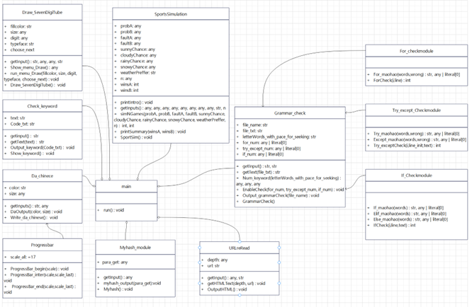

# Python_homework
现代编程技术大作业
===
主要功能
-
    1.哈希函数
    2.写“大”字程序
    3.七段数码管显示
         (1)显示输入的日期
         (2)显示当前系统时间
         (3)显示任意数字
    4.显示main文本中的保留字
    5.模拟A和B的竞技比赛
    6.读同一个页面中的多个URL
    7.语法检测器  
 开发环境
 -
    VScode, pythonIDLE
 项目结构简介
 -
 
 历史版本
 -
    [暂无]
 联系方式
 -
    邮箱：3019232047@tju.edu.cn
